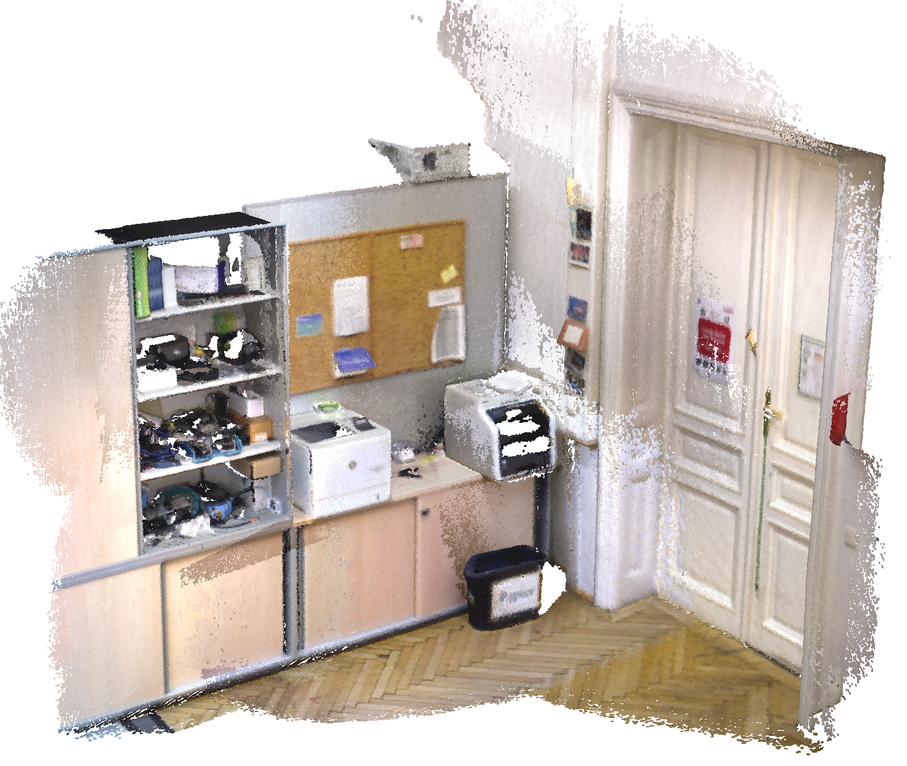
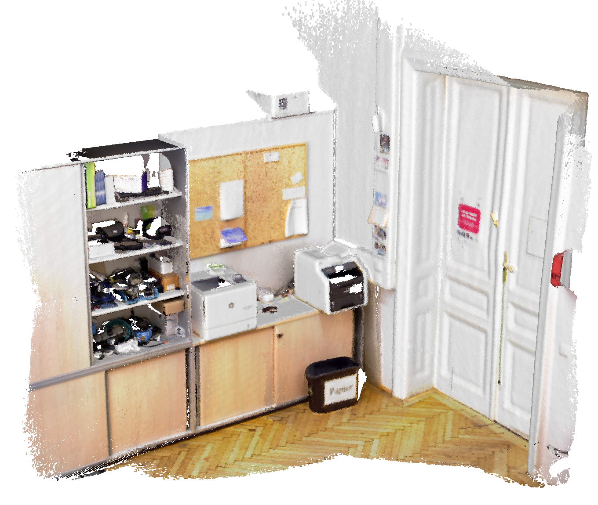
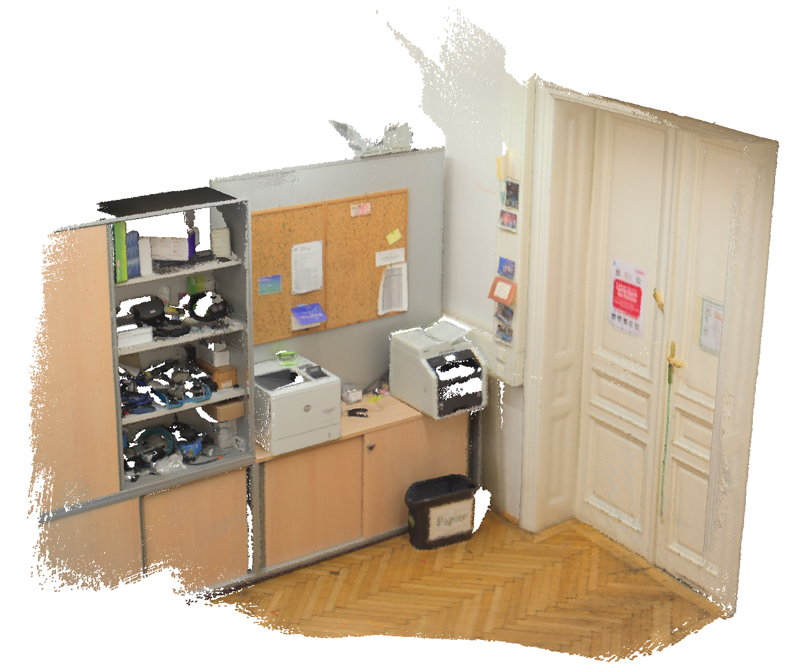

This fork contains a set of extensions for ElasticFusion that allow to
reconstruct maps with High Dynamic Range (HDR) colors. For lack of a better
name, we call it HDR-SLAM.

# Why should I care?

Vanilla ElasticFusion (and most other state-of-the-art dense mapping systems)
takes naive approach to handling colors. It simply averages pixel observations,
without paying attention to possible differences in exposure time or white
balance between different images. As a result, you get reconstructions like
this:

<p align="center"></p>

Not necessarily every reconstruction will be this bad, but some artifacts will
always be present. One possibility to overcome this issue is to disable the
automatic exposure time controller (AEC) and automatic white balance (AWB)
functions of the camera. However, if your scene has higher dynamic range than
that of a single camera image (which most often will be the case), then you will
get a reconstruction like this:

<p align="center"></p>

Note that parts of the reconstruction are white (i.e. were over-exposed) and do
not contain the information about the actual color of the surfaces.

HDR-SLAM, in contrast, handles colors in HDR space, takes into account the
differences in exposure time, and, what's more, controls exposure time itself in
order to obtain as good reconstruction as possible. It will give you a
reconstruction like this:

<p align="center"></p>

Please refer to our [paper][] and [video][] for details and more examples.

# What do I need to build this?

To begin with, you need to install everything that vanilla ElastiFusion
requires, so refer to [this section](#1-what-do-i-need-to-build-it). Note that
though ElasticFusion supports multiple Ubuntu versions as well as Windows, this
fork was developed and is known to work only on Ubuntu 16.04. It may work on
other platforms just fine, but no guarantees.

The only additional required dependency of HDR-SLAM is the [radical][] library,
which is used to radiometrically rectify camera images. Please refer to their
installation and camera calibration instructions.

# What exactly are the differences compared to vanilla ElasticFusion?

1. Colors in the map are represented in HDR space, each channel has 16 bits.
   * Note that even though the original ElasticFusion used only 24 bits to
     represent a color, it still allocated 64 bits, so this change has no impact
     on the GPU memory footprint.
   * The format of the output PLY files is updated accordingly, color channels
     are written out with unsigned short integers.
2. Auto exposure time and white balance controllers of the camera are disabled
   and the system adjusts exposure time itself.
3. Camera grabbers expose API to change exposure time and gain settings.
4. The reconstructed scene can be rendered using arbitrary exposure time that
   can be selected using a slider in the GUI.
5. Minimum OpenGL version requirement is lifted to 4.3.

# How to run this?

HDR-SLAM supports all command-line options of the original ElasticFusion (see
the list [here](#4-how-do-i-use-it)), plus several additions:

* *-crf < radiometric-calibration-file >* : Radiometric calibration file (required);
* *-vgn < vignetting-calibration-file >* : Vignetting calibration file (required);
* *-min-exposure < min-exposure-time >* : Minimum exposure time that the
    controller can choose (default: *1*);
* *-max-exposure < max-exposure-time >* : Maximum exposure time that the
    controller controller can choose (default: *33*). Beware that going beyond
    33 ms may cause significant motion blur;
* *-gain < camera-gain >* : Camera gain (default: *200*), set to a higher value if
    the scene is not well-lit.

The first two options are compulsory. You need to radiometrically calibrate your
camera with [radical][] and supply the calibration files.

Note that you may want to set ElasticFusion's ICP/RGB tracking weight to 100 by
passing *-i 100* option (effectively, disable RGB tracking). According to our
experiments, alignment in HDR space sometimes fails and may hinder the tracking
performance.

# Citing

If you use this in the academic context, please cite the following paper:

> [**High Dynamic Range SLAM with Map-Aware Exposure Time Control**][paper], *S. V. Alexandrov, J. Prankl, M. Zillich, M. Vincze*, 3DV'17

Goes without saying, you should also cite the [original ElasticFusion
papers](#related-publications).

# License

For the systems as a whole, please refer to the original ElasticFusion
[license](#7-license). As for the source code bits introduced in this fork, I do
not care, so consider them [unlicensed](unlicense.org).

[paper]: https://www.dropbox.com/s/ew29y4uvl48tshs/alexandrov_2017_3dv.pdf?dl=0
[video]: https://youtu.be/u47kNI2b4ww
[radical]: https://github.com/taketwo/radical

---

# Original README

# ElasticFusion #

Real-time dense visual SLAM system capable of capturing comprehensive dense globally consistent surfel-based maps of room scale environments explored using an RGB-D camera.

# Related Publications #
Please cite this work if you make use of our system in any of your own endeavors:

* **[ElasticFusion: Real-Time Dense SLAM and Light Source Estimation](http://www.thomaswhelan.ie/Whelan16ijrr.pdf)**, *T. Whelan, R. F. Salas-Moreno, B. Glocker, A. J. Davison and S. Leutenegger*, IJRR '16
* **[ElasticFusion: Dense SLAM Without A Pose Graph](http://thomaswhelan.ie/Whelan15rss.pdf)**, *T. Whelan, S. Leutenegger, R. F. Salas-Moreno, B. Glocker and A. J. Davison*, RSS '15

# 1. What do I need to build it? #

## 1.1. Ubuntu ##

* Ubuntu 14.04, 15.04 or 16.04 (Though many other linux distros will work fine)
* CMake
* OpenGL
* [CUDA >= 7.0](https://developer.nvidia.com/cuda-downloads)
* [OpenNI2](https://github.com/occipital/OpenNI2)
* SuiteSparse
* Eigen
* zlib
* libjpeg
* [Pangolin](https://github.com/stevenlovegrove/Pangolin)
* [librealsense] (https://github.com/IntelRealSense/librealsense) - Optional (for Intel RealSense cameras)

Firstly, add [nVidia's official CUDA repository](https://developer.nvidia.com/cuda-downloads) to your apt sources, then run the following command to pull in most dependencies from the official repos:

```bash
sudo apt-get install -y cmake-qt-gui git build-essential libusb-1.0-0-dev libudev-dev openjdk-7-jdk freeglut3-dev libglew-dev cuda-7-5 libsuitesparse-dev libeigen3-dev zlib1g-dev libjpeg-dev
```

Afterwards install [OpenNI2](https://github.com/occipital/OpenNI2) and [Pangolin](https://github.com/stevenlovegrove/Pangolin) from source. Note, you may need to manually tell CMake where OpenNI2 is since Occipital's fork does not have an install option. It is important to build Pangolin last so that it can find some of the libraries it has optional dependencies on. 

When you have all of the dependencies installed, build the Core followed by the GUI. 

## 1.2. Windows - Visual Studio ##
* Windows 7/10 with Visual Studio 2013 Update 5 (Though other configurations may work)
* [CMake] (https://cmake.org/)
* OpenGL
* [CUDA >= 7.0](https://developer.nvidia.com/cuda-downloads)
* [OpenNI2](https://github.com/occipital/OpenNI2)
* [SuiteSparse] (https://github.com/jlblancoc/suitesparse-metis-for-windows)
* [Eigen] (http://eigen.tuxfamily.org)
* [Pangolin](https://github.com/stevenlovegrove/Pangolin)
  * zlib (Pangolin can automatically download and build this)
  * libjpeg (Pangolin can automatically download and build this)
* [librealsense] (https://github.com/IntelRealSense/librealsense) - Optional (for Intel RealSense cameras)

Firstly install cmake and cuda. Then download and build from source OpenNI2, SuiteSparse. Next download Eigen (no need to build it since it is a header-only library). Then download and build from source Pangolin but pay attention to the following cmake settings. There will be a lot of dependencies where path was not found. That is OK except OPENNI2 and EIGEN3 (those should be set to valid paths). You also need to set MSVC_USE_STATIC_CRT to false in order to correctly link to ElasticFusion projects. Also, you can set BUILD_EXAMPLES to false since we don't need them and some were crashing on my machine.

Finally, build Core and GUI.


# 2. Is there an easier way to build it? #
Yes, if you run the *build.sh* script on a fresh clean install of Ubuntu 14.04, 15.04, or 16.04, enter your password for sudo a few times and wait a few minutes all dependencies will get downloaded and installed and it should build everything correctly. This has not been tested on anything but fresh installs, so I would advise using it with caution if you already have some of the dependencies installed.

# 3. Installation issues #

***`#include <Eigen/Core>` not found***

```bash
sudo ln -sf /usr/include/eigen3/Eigen /usr/include/Eigen
sudo ln -sf /usr/include/eigen3/unsupported /usr/include/unsupported
```

***invalid use of incomplete type ‘const struct Eigen ...***

Pangolin must be installed AFTER all the other libraries to make use of optional dependencies.

***GLSL 3.30 is not supported. Supported versions are 1.10, 1.20, 1.30, 1.00 ES and 3.00 ES***

Make sure you are running ElasticFusion on your nVidia GPU. In particular, if you have an Optimus GPU
- If you use Prime, follow instructions [here](http://askubuntu.com/questions/661922/how-am-i-supposed-to-use-nvidia-prime)
- If you use Bumblebee, remember to run as `optirun ./ElasticFusion`

# 4. How do I use it? #
There are three subprojects in the repo:

* The *Core* is the main engine which builds into a shared library that you can link into other projects and treat like an API. 
* The *GUI* is the graphical interface used to run the system on either live sensor data or a logged data file. 
* The *GPUTest* is a small benchmarking program you can use to tune the CUDA kernel launch parameters used in the main engine. 

The GUI (*ElasticFusion*) can take a bunch of parameters when launching it from the command line. They are as follows:

* *-cal <calibration>* : Loads a camera calibration file specified as *fx fy cx cy*.
* *-l <logfile>* : Processes the specified .klg log file.
* *-p <poses>* : Loads ground truth poses to use instead of estimated pose.
* *-c <confidence>* : Surfel confidence threshold (default *10*).
* *-d <depth>* : Cutoff distance for depth processing (default *3*m).
* *-i <icp>* : Relative ICP/RGB tracking weight (default *10*).
* *-ie <error>* : Local loop closure residual threshold (default *5e-05*).
* *-ic <count>* : Local loop closure inlier threshold (default *35000*).
* *-cv <covariance>* : Local loop closure covariance threshold (default *1e-05*).
* *-pt <photometric>* : Global loop closure photometric threshold (default *115*).
* *-ft <threshold>* : Fern encoding threshold (default *0.3095*).
* *-t <time>* : Time window length (default *200*).
* *-s <skip>* : Frames to skip at start of log.
* *-e <end>* : Cut off frame of log.
* *-f* : Flip RGB/BGR.
* *-icl* : Enable this if using the [ICL-NUIM](http://www.doc.ic.ac.uk/~ahanda/VaFRIC/iclnuim.html) dataset (flips normals to account for negative focal length on that data).
* *-o* : Open loop mode.
* *-rl* : Enable relocalisation.
* *-fs* : Frame skip if processing a log to simulate real-time.
* *-q* : Quit when finished a log.
* *-fo* : Fast odometry (single level pyramid).
* *-nso* : Disables SO(3) pre-alignment in tracking.
* *-r* : Rewind and loop log forever. 
* *-ftf* : Do frame-to-frame RGB tracking. 
* *-sc* : Showcase mode (minimal GUI).

Essentially by default *./ElasticFusion* will try run off an attached ASUS sensor live. You can provide a .klg log file instead with the -l parameter. You can capture .klg format logs using either [Logger1](https://github.com/mp3guy/Logger1) or [Logger2](https://github.com/mp3guy/Logger2). 

# 5. How do I just use the Core API? #
The libefusion.so shared library which gets built by the Core is what you want to link against.

An example of this can be seen in the GUI code. Essentially all you need to do is utilise the provided Findefusion.cmake file in GUI/src and include the following in your CMakeLists.txt file:

    find_package(efusion REQUIRED)
    include_directories(${EFUSION_INCLUDE_DIR})
    target_link_libraries(MyProject ${EFUSION_LIBRARY})
    
To then use the Core API, make sure to include the header file in your source file:
```cpp
    #include <ElasticFusion.h>
```

Initialise the static configuration parameters once somewhere at the start of your program (this [smells](http://en.wikipedia.org/wiki/Code_smell), but whatever):
```cpp
    Resolution::getInstance(640, 480);
    Intrinsics::getInstance(528, 528, 320, 240);
```

Create an OpenGL context before creating an ElasticFusion object, as ElasticFusion uses OpenGL internally. You can do this whatever way you wish, using Pangolin is probably easiest given it's a dependency:
```cpp
    pangolin::Params windowParams;
    windowParams.Set("SAMPLE_BUFFERS", 0);
    windowParams.Set("SAMPLES", 0);
    pangolin::CreateWindowAndBind("Main", 1280, 800, windowParams);
```

Make an ElasticFusion object and start using it:
```cpp
    ElasticFusion eFusion;
    eFusion.processFrame(rgb, depth, timestamp, currentPose, weightMultiplier);
```

See the source code of MainController.cpp in the GUI source to see more usage.

# 6. Datasets #

We have provided a sample dataset which you can run easily with ElasticFusion for download [here](http://www.doc.ic.ac.uk/~sleutene/datasets/elasticfusion/dyson_lab.klg). Launch it as follows:

```bash
./ElasticFusion -l dyson_lab.klg
```

# 7. License #
ElasticFusion is freely available for non-commercial use only.  Full terms and conditions which govern its use are detailed [here](http://www.imperial.ac.uk/dyson-robotics-lab/downloads/elastic-fusion/elastic-fusion-license/) and in the LICENSE.txt file.

# 8. FAQ #
***What are the hardware requirements?***

A [very fast nVidia GPU (3.5TFLOPS+)](https://en.wikipedia.org/wiki/List_of_Nvidia_graphics_processing_units#GeForce_900_Series), and a fast CPU (something like an i7). If you want to use a non-nVidia GPU you can rewrite the tracking code or substitute it with something else, as the rest of the pipeline is actually written in the OpenGL Shading Language. 

***How can I get performance statistics?***

Download [Stopwatch](https://github.com/mp3guy/Stopwatch) and run *StopwatchViewer* at the same time as ElasticFusion. 

***I ran a large dataset and got assert(graph.size() / 16 < MAX_NODES) failed***

Currently there's a limit on the number of nodes in the deformation graph down to lazy coding (using a really wide texture instead of a proper 2D one). So we're bound by the maximum dimension of a texture, which is 16384 on modern cards/OpenGL. Either fix the code so this isn't a problem any more, or increase the modulo factor in *Shaders/sample.geom*. 

***I have a nice new laptop with a good GPU but it's still slow***

If your laptop is running on battery power the GPU will throttle down to save power, so that's unlikely to work (as an aside, [Kintinuous](https://github.com/mp3guy/Kintinuous) will run at 30Hz on a modern laptop on battery power these days). You can try disabling SO(3) pre-alignment, enabling fast odometry, only using either ICP or RGB tracking and not both, running in open loop mode or disabling the tracking pyramid. All of these will cost you accuracy. 

***I saved a map, how can I view it?***

Download [Meshlab](http://meshlab.sourceforge.net/). Select Render->Shaders->Splatting. 

***The map keeps getting corrupted - tracking is failing - loop closures are incorrect/not working***

Firstly, if you're running live and not processing a log file, ensure you're hitting 30Hz, this is important. Secondly, you cannot move the sensor extremely fast because this violates the assumption behind projective data association. In addition to this, you're probably using a primesense, which means you're suffering from motion blur, unsynchronised cameras and rolling shutter. All of these are aggravated by fast motion and hinder tracking performance. 

If you're not getting loop closures and expecting some, pay attention to the inlier and residual graphs in the bottom right, these are an indicator of how close you are to a local loop closure. For global loop closures, you're depending on [fern keyframe encoding](http://www.doc.ic.ac.uk/~bglocker/pdfs/glocker2015tvcg.pdf) to save you, which like all appearance-based place recognition methods, has its limitations. 

***Is there a ROS bridge/node?***

No. The system relies on an extremely fast and tight coupling between the mapping and tracking on the GPU, which I don't believe ROS supports natively in terms of message passing. 

***This doesn't seem to work like it did in the videos/papers***

A substantial amount of refactoring was carried out in order to open source this system, including rewriting a lot of functionality to avoid certain licenses and reduce dependencies. Although great care was taken during this process, it is possible that performance regressions were introduced and have not yet been discovered.
